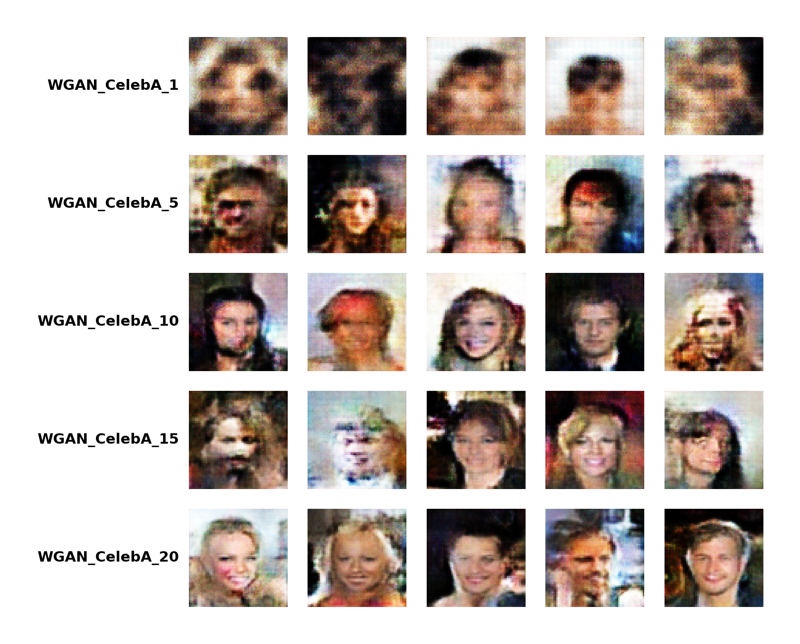

# Image Generation with Deep Learning

A PyTorch implementation of popular generative models for image synthesis, featuring VAE, DCGAN, and WGAN architectures trained on the CelebA dataset.



## Overview

This project implements three different generative modeling approaches for creating synthetic face images:

- **VAE (Variational Autoencoder)**: Learns a probabilistic latent representation of images
- **DCGAN (Deep Convolutional GAN)**: Uses adversarial training with convolutional networks
- **WGAN (Wasserstein GAN)**: Improves GAN stability with Wasserstein distance and gradient penalty

All models are designed to generate 64x64 RGB images and support training on the CelebA dataset.

## Features

- Modular architecture with separate model and trainer implementations
- Checkpoint saving and resuming for long training sessions
- Optional experiment tracking with Neptune.ai
- Support for multiple hardware accelerators (CPU, CUDA, MPS)
- Visualization tools for generating image grids from trained models
- Comprehensive logging and metrics tracking

## Installation

This project uses `uv` for dependency management. Make sure you have Python 3.11 or higher installed.

```bash
# Clone the repository
git clone <your-repo-url>
cd Image-Generation

# Install dependencies
uv sync

# Optional: Install tracking dependencies for Neptune.ai
uv sync --extra tracking

# Optional: Install plotting dependencies for visualization
uv sync --extra plotting
```

## Dataset Setup

Download the CelebA dataset and extract it to a directory. You'll need to specify the path to the image directory when training.

## Usage

### Training

Basic training command:

```bash
uv run train.py --model <MODEL> --dataset CelebA --image-directory <PATH_TO_IMAGES>
```

#### VAE Training

```bash
uv run train.py \
  --model VAE \
  --dataset CelebA \
  --image-directory ./data/celeba/img_align_celeba/img_align_celeba \
  --batch-size 256 \
  --epochs 20 \
  --latent-dim 256 \
  --hidden-dim 128 \
  --lr 1e-3
```

#### DCGAN Training

```bash
uv run train.py \
  --model DCGAN \
  --dataset CelebA \
  --image-directory ./data/celeba/img_align_celeba/img_align_celeba \
  --batch-size 256 \
  --epochs 20 \
  --latent-dim 256 \
  --hidden-dim 128 \
  --lr_generator 1e-4 \
  --lr_discriminator 1e-4 \
  --beta1 0.5 \
  --beta2 0.999
```

#### WGAN Training

```bash
uv run train.py \
  --model WGAN \
  --dataset CelebA \
  --image-directory ./data/celeba/img_align_celeba/img_align_celeba \
  --batch-size 256 \
  --epochs 20 \
  --latent-dim 256 \
  --hidden-dim 128 \
  --lr_generator 1e-4 \
  --lr_critic 2e-4 \
  --beta1 0.5 \
  --beta2 0.999 \
  --lambda-gp 10 \
  --n-critic 5
```

### Resuming Training

To resume training from a checkpoint:

```bash
uv run train.py \
  --model <MODEL> \
  --dataset CelebA \
  --image-directory <PATH_TO_IMAGES> \
  --resume-from <EPOCH_NUMBER>
```

### Visualization

Generate image grids from trained model checkpoints:

```bash
uv run visualize.py \
  --model <MODEL> \
  --checkpoint-paths <PATH_TO_CHECKPOINT_1> <PATH_TO_CHECKPOINT_2> ... \
  --output-path ./output/visualization.png \
  --n-images 5
```

### Neptune.ai Tracking

Track your experiments with Neptune.ai:

```bash
uv run train.py \
  --model <MODEL> \
  --dataset CelebA \
  --image-directory <PATH_TO_IMAGES> \
  --neptune-project <YOUR_PROJECT> \
  --neptune-token <YOUR_API_TOKEN>
```

## Command Line Arguments

### General Arguments

- `--model`: Model architecture (VAE, DCGAN, or WGAN) [required]
- `--dataset`: Dataset name (CelebA) [required]
- `--image-directory`: Path to image directory [required]
- `--batch-size`: Training batch size (default: 256)
- `--epochs`: Number of training epochs (default: 20)
- `--checkpoint-directory`: Directory for saving checkpoints (default: .checkpoints)
- `--log-directory`: Directory for logs (default: .logs)
- `--device`: Device to use (cpu, mps, or cuda)
- `--resume-from`: Checkpoint epoch number to resume from

### Training Arguments

- `--latent-dim`: Latent space dimensionality (default: 256)
- `--hidden-dim`: Base hidden layer dimension (default: 128)
- `--lr`: Learning rate for VAE (default: 1e-3)
- `--lr_generator`: Generator learning rate for DCGAN/WGAN (default: 1e-4)
- `--lr_discriminator`: Discriminator learning rate for DCGAN (default: 1e-4)
- `--lr_critic`: Critic learning rate for WGAN (default: 2e-4)
- `--beta1`: Adam optimizer beta1 parameter (default: 0.5)
- `--beta2`: Adam optimizer beta2 parameter (default: 0.999)
- `--lambda-gp`: Gradient penalty coefficient for WGAN (default: 10)
- `--n-critic`: Number of critic updates per generator update for WGAN (default: 5)

### Neptune Arguments

- `--neptune-project`: Neptune.ai project name
- `--neptune-token`: Neptune.ai API token

### Visualization Arguments

- `--checkpoint-paths`: Paths to model checkpoints [required]
- `--output-path`: Output path for visualization [required]
- `--n-images`: Number of images to generate per checkpoint (default: 5)

## Project Structure

```
Image-Generation/
├── models/              # Model architectures
│   ├── VAE.py          # Variational Autoencoder
│   ├── DCGAN.py        # Deep Convolutional GAN
│   └── WGAN.py         # Wasserstein GAN
├── trainers/           # Training logic for each model
│   ├── VAE.py
│   ├── DCGAN.py
│   └── WGAN.py
├── datasets/           # Dataset loaders
│   └── CelebA.py
├── utils/              # Utility functions
│   ├── args.py         # Argument parsing
│   ├── arg_handlers.py # Trainer/dataset factory
│   ├── checkpoint.py   # Checkpoint management
│   ├── device.py       # Device configuration
│   └── logger.py       # Logging utilities
├── train.py            # Main training script
├── visualize.py        # Visualization script
└── README.md
```

## Model Architectures

### VAE (Variational Autoencoder)

- **Architecture**: Encoder-decoder with convolutional layers
- **Latent Space**: Probabilistic with reparameterization trick
- **Loss Function**: Reconstruction loss (BCE) + KL divergence
- **Use Case**: Smooth latent space interpolation, controlled generation

### DCGAN (Deep Convolutional GAN)

- **Architecture**: ConvTranspose2d generator, Conv2d discriminator
- **Training**: Adversarial training with binary cross-entropy
- **Stability**: Batch normalization, LeakyReLU, careful initialization
- **Use Case**: High-quality image generation

### WGAN (Wasserstein GAN)

- **Architecture**: Similar to DCGAN but with critic instead of discriminator
- **Training**: Wasserstein distance with gradient penalty
- **Stability**: Improved training stability, meaningful loss metric
- **Use Case**: More stable training, better convergence

## Requirements

- Python >= 3.11
- PyTorch >= 2.9.1
- torchvision >= 0.24.1
- Pillow >= 12.1.0
- tqdm >= 4.67.1

Optional:
- neptune >= 1.14.0 (for experiment tracking)
- matplotlib >= 3.10.8 (for visualization)

## License

This project is available under the MIT License.

## Acknowledgments

- CelebA dataset: [Large-scale CelebFaces Attributes Dataset](http://mmlab.ie.cuhk.edu.hk/projects/CelebA.html)
- Inspired by the original papers:
  - [Auto-Encoding Variational Bayes](https://arxiv.org/abs/1312.6114)
  - [Unsupervised Representation Learning with Deep Convolutional GANs](https://arxiv.org/abs/1511.06434)
  - [Wasserstein GAN](https://arxiv.org/abs/1701.07875)
  - [Improved Training of Wasserstein GANs](https://arxiv.org/abs/1704.00028)
